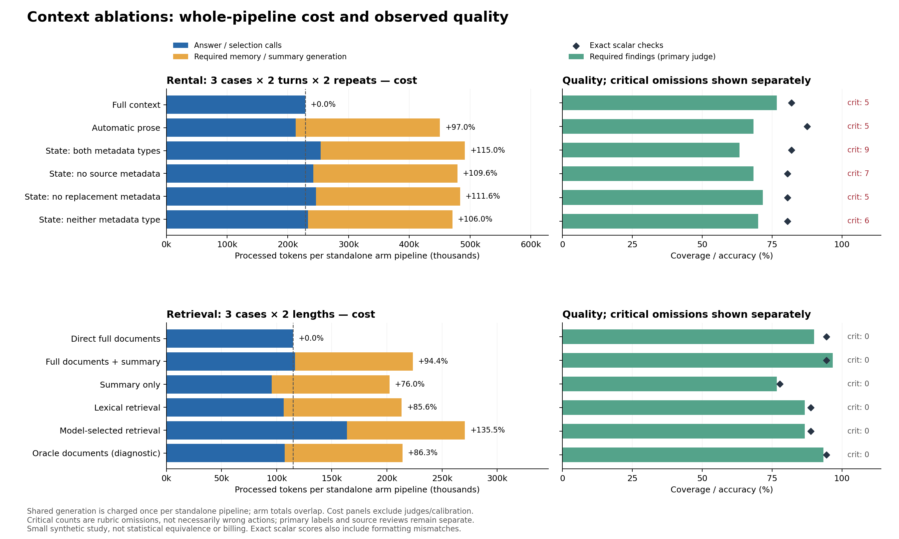

# 完整 ablation study：成本、品質與下一步

本次已跑完事先宣告的矩陣：**156 次模型呼叫、108 份最終答案、18 次新案例評分、8 次舊案例校準，共 3,367,888 processed tokens**。兩個可選檢索步驟由模型選擇直接回答而略過，沒有失敗重跑。全程不使用 Claude；原本七場 Claude 確認試驗維持暫停。

**這輪沒有任何可採用候選通過「整條流程至少省 10%」的門檻。** 在這些兩輪租屋對話、每組文件只問一次的情境，生成摘要／記憶的成本超過答題節省。品質也不能宣告等效：找到真實錯值、資訊遺漏、錯誤推薦及過度限制的操作建議。同時，原始評分混入許多格式差異與說明完整度問題，因此以下保留原始結果，並另列來源複核。

本研究的「完整」是跑完已宣告的組件矩陣，不代表所有架構組合或足以證明統計等效的大樣本研究。六個新案例都是合成資料；沒有真實使用者試驗或人工 ground truth。

## 1. 成本與品質總表

下表的 pipeline 成本包含該組必要的生成／更新；不含研究用裁判與校準。各組共用生成器，**組別成本不能相加當成實驗總量**。租屋生成器同時產出 prose 和 facts，單獨採用任一壓縮組都負擔完整生成器成本；這不是另行優化的純摘要器成本。

Findings 是原始模型裁判的判準覆蓋；scalar 是原始字面檢查。Critical 是被標成重要的判準遺漏，**不等於錯誤行動或已發生的傷害**。Oracle 使用事先知道的必要文件 ID，僅作診斷對照。

| 實驗 | 組別 | 答題 tokens | 生成／更新 | Pipeline | 對基準變化 | Findings | Exact scalars | Critical |
|---|---|---:|---:|---:|---:|---:|---:|---:|
| 租屋 | full | 228,626 | 0 | 228,626 | 基準 | 46/60 | 59/72 | 5 |
| 租屋 | prose | 212,947 | 237,459 | 450,406 | +97.01% | 41/60 | 63/72 | 5 |
| 租屋 | state | 254,078 | 237,459 | 491,537 | +115.00% | 38/60 | 59/72 | 9 |
| 租屋 | state_no_sources | 241,805 | 237,459 | 479,264 | +109.63% | 41/60 | 58/72 | 7 |
| 租屋 | state_no_updates | 246,215 | 237,459 | 483,674 | +111.56% | 43/60 | 58/72 | 5 |
| 租屋 | state_neither | 233,499 | 237,459 | 470,958 | +105.99% | 42/60 | 58/72 | 6 |
| 檢索 | raw_full | 114,923 | 0 | 114,923 | 基準 | 27/30 | 34/36 | 0 |
| 檢索 | full＋summary | 116,557 | 106,853 | 223,410 | +94.40% | 29/30 | 34/36 | 0 |
| 檢索 | summary | 95,402 | 106,853 | 202,255 | +75.99% | 23/30 | 28/36 | 0 |
| 檢索 | lexical | 106,476 | 106,853 | 213,329 | +85.63% | 26/30 | 32/36 | 0 |
| 檢索 | adaptive | 163,811 | 106,853 | 270,664 | +135.52% | 26/30 | 32/36 | 0 |
| 檢索 | oracle | 107,197 | 106,853 | 214,050 | +86.26% | 28/30 | 34/36 | 0 |



可匯出的 [SVG](figures/cost-quality.svg)、[全部 108 份答案與配對表格](numerical-tables.md)、[可重算數據](ablation-results.json) 均保留。圖表沿用原始分數，下面的語義複核不覆寫它。

## 2. 記憶 ablation 得到了什麼

設計為 3 案例 × 2 輪 × 2 次重複 × 6 組，共 72 份答案。四個 state 組取自相同 fact rows，只分別移除 `source_id/quote` 與 `status/supersedes`；其餘內容、qualification、ID 和排列保持相同。

這測的是**共同完整更新器下，答題模型消費 metadata 的效果**。`state_no_updates` 仍經過更新，只是看不到明示替代關係。更新器仍取得完整 prior memory，各組第二輪也保留自己的前次回答。因此不能把結果外推為不需要來源、不需要版本管理，或四個不同端到端壓縮器的表現。

**結構化不等於壓縮。** 12 次生成產出 40–48 筆 fact rows。完整 state 的答題成本比 full 高 11.13%；連兩種 metadata 都移除後，答題成本仍高 2.13%。Prose 的答題成本低 6.86%，但加入生成／更新後總成本增加 97.01%。

以下是依相同案例／輪次／重複配對的 2×2 平均效果；品質單位是每份答案的原始 finding 數，token 正值代表保留欄位後更耗。

| 指標 | Source metadata effect | Replacement metadata effect | Interaction |
|---|---:|---:|---:|
| Findings／answer | −0.083 | −0.250 | −0.333 |
| Answer tokens／answer | +1,041.208 | +673.708 | −36.917 |

Source effect 在 T1／T2 的品質變化是 −0.167／0；replacement effect 是 −0.167／−0.333。這些小樣本結果沒有呈現穩定品質收益，也不能證明 metadata 造成普遍傷害。36 個同案例／輪次／組別的重複配對中，20 個的 finding 得分改變；state 第二次重複的總得分比第一次低 6，其中一次明顯錯誤推薦影響很大。T1→T2 問題和判準也不同，只能描述進程，不能把分數差當成相同考題的改善率。

具體失敗比平均分更有解釋力：

- **數字正確，決策仍錯。** `S1-r2-T1-state` 六個 scalar 全對，卻推薦 £2,160 的 Mosslantern，超過 £2,130 硬上限。後文雖承認超支，開頭與訊息草稿仍保留錯誤推薦。它第二輪沿用自己的先前選擇，於報價改變後做對當前決定，卻留下 keep／change 的敘述不一致。
- **摘要遺漏後又用錯替代值。** `S2-r2-T1-prose` 的 prose memory 漏掉 £2,010 房源估計；答案再把保留的 £2,050 使用者上限當成房源成本。這同時包含生成器遺漏和答題模型的不當填補。
- **資訊存在也可能輸出不一致。** 同案 state 與 state_no_sources 的 memory、正文都有 19 February，scalar 卻填 unknown。`S3-r2-T2-full` 正文有退款截止 15:00，scalar 只給日期。Full 也不是完美基準。
- **新資料的來源指向可能錯。** 部分 T2 回答把最新使用者訊息中的正確數值歸到舊 memory。這是可追溯性問題，即使當下的數值與決定仍正確。

租屋 37 個原始 critical 標記經逐項來源複核，36 個屬溝通契約要求的說明遺漏，例如沒有重述 studio acceptance、沒有明說 44 ≥ 40 m²、沒有解釋舊通知再次轉寄的意義；另 1 個對應上述錯誤房源推薦。保留原始扣分，但沒有據此宣稱模型發生 37 次嚴重行動失敗。

## 3. 檢索、摘要與長度控制

三個新案例分別要求有界核准、拒絕啟用、承認歷史內容無法驗證；各有同一決定性證據的 short／long 版本。短版全文是長版的完整前綴，長版增加不同營運背景，不是重複文字 padding。每格只有一次答案，沒有估計一般性的長度損益平衡曲線。

| 配對變化（六格合計） | Pipeline tokens 變化 | 原始 findings 變化 |
|---|---:|---:|
| raw_full → 全文加摘要 | +108,487 | +2 |
| 全文加摘要 → 只用摘要 | −21,155 | −6 |
| 只用摘要 → lexical | +11,074 | +3 |
| lexical → oracle | +721 | +2 |
| adaptive → oracle | −56,614 | +2 |

最後一列同時改變選文件方式和呼叫步驟，不能解釋為純粹移除一次呼叫的因果效果。Oracle 有答案特權，不能直接部署。全文加摘要合計多拿 2 個 finding（每份平均 +0.333），但成本幾乎加倍，仍未過採用門檻。

所有 oracle 都使用 D01＋D02；實際選擇如下。D01 等以各案例的 ID 為前綴。

| 格子 | Lexical 選擇 | Adaptive 選擇 | Adaptive findings |
|---|---|---|---:|
| E1 short | D01、D03 | D01、D02 | 5/5 |
| E1 long | D01、D04 | 不取文件，直接回答 | 3/5 |
| E2 short | D01、D04 | D01、D02 | 5/5 |
| E2 long | D01、D04 | D01、D02 | 4/5 |
| E3 short | D01、D02 | D01、D02 | 4/5 |
| E3 long | D01、D04 | 不取文件，直接回答 | 5/5 |

Lexical 六格只有一格取齊兩份必要文件，但摘要有時補回其他格所需的資訊；不能把答案得分直接當成 ranker recall。四次實際 adaptive 檢索都選對文件，兩次選擇不檢索。E1 long 因此比 short 少耗，但 finding 從 5 降到 3；E3 的得分則由 4 升至 5。**較長文件那兩格較便宜，是呼叫數改變，並非長文件本身變便宜。**

資料遺漏也有不同來源。E1 short 的 summary／lexical 沒有總體 Larch 46/48，回答 unknown 是對可見證據誠實，但仍未完成所需資訊；E1 long lexical 的摘要已含 46/48，回答 unknown 就是答題遺漏。E2 short summary 省略明示 `dispatch_enabled=false`；E3 short summary 省略 18 頁與 1 頁的精確數量。這些不是原始來源真的未知。

另一方面，E3 的「實際使用哪版資料」在來源中本來就無法確定。所有六組都保留 requested/displayed R7 與 actual revision unknown 的區別；沒有因為工具回報完成、產出 18 頁就證明內容使用了 R7。這是適當的不確定性，不應因填 unknown 而扣錯類型的分數。

來源複核另發現 E2 summary 的操作建議過度擴張：拒絕 Birch 有依據，但把 dispatcher 一概保持關閉、限制明日原本可用 Cedar 的批次，是另一個問題。「這次不要實際操作」是執行界線，不能無條件轉成對使用者所有後續操作的禁令。沒有宣稱實際發生停機或損失。

## 4. 最終品質有差嗎？先分開看三種量測

**有觀察到差異，沒有證明等效。** 但原始分數與實際錯誤之間不能直接畫等號。

108 份答案的 648 個 scalar 中，原始為 549 pass／99 fail。99 個 fail 全部逐筆來源複核：86 個是格式／措辭等價、3 個日期可由可見上下文補足年份、9 個缺失／unknown 輸出、1 個真正錯值。保留全部原始分數；事後語義敏感度為 638/648，**不是重新宣告整份答案正確**。

| 組別 | 原始 scalar | 事後來源語義敏感度 |
|---|---:|---:|
| Rental full／prose／state／state_no_sources | 59／63／59／58（各 72） | 各 71/72 |
| Rental state_no_updates／state_neither | 各 58/72 | 各 72/72 |
| Retrieval raw_full／full／oracle | 各 34/36 | 各 36/36 |
| Retrieval adaptive | 32/36 | 36/36 |
| Retrieval lexical | 32/36 | 34/36 |
| Retrieval summary | 28/36 | 32/36 |

例如 `not booked` 與 `unbooked`、正確單位名稱加上完整地址、`operating` 與 `operational`，不應被說成記憶失真。但缺少 15:00、把已知日期填 unknown、用預算替代房源成本，仍保留為非等價。缺證據而合理填 unknown 也可能代表整條流程遺漏了使用者所需的資訊。[全部 scalar 複核](scalar-source-review.md) 與 [原始／語義比較](scalar-reconciliation.md) 可逐筆追查。

新答案出現前固定選了六組、每組所有六個候選，共 36 份答案做匿名來源複核；複核者不審自己編寫的案例，也不看 arm、成本或主要裁判結果。結果如下，**兩份評分都保留，不把後者視為人工真值**。

| 預先選定組 | 主要裁判 | 獨立來源複核 | 判準分歧數 |
|---|---:|---:|---:|
| S1-r1-T2 | 20/30 | 29/30 | 9 |
| S2-r2-T1 | 28/30 | 20/30 | 8 |
| S3-r1-T2 | 16/30 | 24/30 | 12 |
| E1 long | 25/30 | 29/30 | 4 |
| E2 short | 30/30 | 24/30 | 6 |
| E3 long | 29/30 | 25/30 | 4 |
| 合計 | 148/180 | 151/180 | 43 |

總分只差 3，卻有 **43/180 判準不同、28/36 答案至少一項不同**，而且方向相反。平均分接近不是高一致性。爭議常在是否要明述每個複合判準、源頭名稱、剩餘檢查，以及合理隱含表達是否足夠。[逐判準對照](source-review-reconciliation.md) 同時保留 gold、兩方理由與匿名揭盲對應；沒有用事後偏好的解釋覆寫主要結果。

另對全部 16 個主要 unsupported／contradiction 標記、37 個 critical omissions、5 個無效答案引用與 memory quote 檢查做了明示為事後選樣的來源審查。337 個檢索引用中，332 個通過精確檢查，其餘 5 個都是內容有根據的標點／大小寫／譯述差異；exact quote 失敗仍保留。事後整答審查選了 50 份答案，其餘 58 份沒有在這份事後審查中重評；另有前述獨立的 36 份預選盲複核。

8 個 memory 無效 quote 是 4 個原始缺陷及其 4 次沿用，內容都受生成當時的來源支持，沒有拿未來 T2 補證；精確引用失敗仍成立。這些檢查只證明被檢查項目的性質，不是對所有記憶事實的完整召回／語義評估。

來源審查仍是 AI 審查，representation 可能讓組別被猜到；沒有人工驗證。這是可追溯的敏感度與失敗分析，不是新的「真實正確率」估計。

## 5. 裁判校準：有改善，但只解決部分問題

四個已知舊案例的八次校準，保持原答案不變。Legacy 花 80,679 tokens，visible 版花 92,731，增加 14.94%。

- A1／A2 的已知錯誤「候選其實沒拿到全文，卻被當成看過」標記由 3＋4 降至 0。
- R3 的兩個 40→42 m² 真錯誤，由 0/2 偵測變成 2/2；R5 的 balcony 假設也被新版本抓到。
- A2 的三段有根據譯文放進 exact quote 欄位，仍有分類混雜：是引用精度缺陷，不等於新增三個虛構事實。

這是「可見證據＋評分規則」一起改的 regression check，案例也是已知錯誤，沒有證明 visibility 單獨的因果效果或未知案例上的判斷準確率。新案例又暴露共用指引沒有完整交給裁判的問題：回答按照指引說看房時不要簽約付款，卻被標為無根據。短版 E2 summary 的 unknown dispatch flag 也不能簡單說成物理狀態矛盾。

因此下一步須校準量測工具：把共同指引、literal configuration 與 operational outcome、必要說明與錯誤決策分開。單靠讓裁判看到更多來源，尚未解決全部問題。[完整校準記錄](calibration-results.md)。

## 6. Controller、實際總量與驗證

`CallControl` 已接進本次 runner，實際管理每個實體 CLI invocation：先持久保存 dispatch，成功回傳後完成登記，失敗或未知 usage 會阻止後續呼叫。已完成的 call 不重跑，未結束的恢復狀態也不自動重試；兩次可選 skip 單獨保存。

Offline 全套 **1,645 tests 通過**，包含實體邊界故障阻擋、重複／恢復去重、舊 38 calls 的 669,726 tokens 重播、完整 158-call stub matrix、未來資訊隔離與共用成本去重。本次 live 完成 156、skip 2、失敗 0、pending 0，controller 最後狀態為 `report_results`。這不等於測過串流故障偵測延遲或全部分散式競爭情況。舊 runner 本來已有部分 Python 統計／stop guards，也不能把這次整合再說成一次新的 85% 節省。

| 實際工作 | 呼叫數 | Processed tokens |
|---|---:|---:|
| 初始答題／檢索決定 | 108 | 2,050,754 |
| 實際檢索後續回答 | 4 | 70,782 |
| 記憶生成／更新 | 12 | 237,459 |
| 文件摘要生成 | 6 | 106,853 |
| 新案例裁判 | 18 | 728,630 |
| 舊案例裁判校準 | 8 | 173,410 |
| 合計 | 156 | 3,367,888 |

Requested models 為 Terra 130 次、Sol 26 次，全部 effort=`low`；這是請求名稱，沒有獨立證明後端內部模型修訂。獨立 raw-event audit 核算 input **3,191,514**＋output **176,374**＝**3,367,888**；cached input **658,560** 已包含在 input，不能再相加。未快取 input 為 2,532,954，也不在這裡換算成帳單。

獨立核帳結果是 **PASS_WITH_DIAGNOSTICS，problems=[]**：624 項呼叫 hash 檢查、來源／prepared hashes、帳本與去重均一致，沒有 orphan、缺失 usage、重複 ID、原生工具事件或 malformed lines。156 份 stderr 都有正常 stdin notice；其中 140 份另有非致命 model-catalog timeout，全部保留。這些不是 140 次模型回答失敗；沒有因此重試或刪除結果。[獨立核帳](independent-run-audit.json)。

**以上總量只含受測 CLI。** 主對話、fixture 編寫、子代理 code review／來源複核與報告整理的 token 不在此總量內；本機計算另計。Processed tokens 不是帳單金額，也不能直接換算訂閱額度或把快取視為零成本。

## 7. 這幾輪合起來的 insights 與採用決定

前面的監控／交接重播，從 7 次 verbose 呼叫改成 3 次 compact 呼叫，302,259 → 44,842 tokens，降低 **85.16%**，三組最後 JSON 完全一致。兩組本來都取得相同 Python 統計，量到的是「減少例行 callback＋縮短保留上下文」這個共同改動，不是新量到移出統計計算的額外收益。它只涵蓋那個固定報告工作，不能外推成整套租屋或帳單都省 85%。

前一輪品質 pilot 已看到：摘要會掉必要資訊，adaptive 多一次呼叫可能比全文更貴；原裁判又有 visibility 誤判。本輪把生成成本、共同更新器、metadata interaction、oracle、raw_full 與長度控制補齊後，更清楚的結論是：

1. **先減少不必要的模型呼叫。** Python 做 progress、usage、去重、停機與表格最有把握。每次先生成摘要，再期待短一點的答案回本，在這個規模不成立。
2. **依可重用次數與品質需求決定壓縮。** 同一份來源只問一次，額外生成成本很難攤平；摘要可重用多久、需不需要更新，是核心條件。
3. **保留資訊不保證正確使用。** 記憶有日期仍填 unknown；六個數字都對仍推薦超支房源。下一個 guard 應驗證可機器判斷的決策與約束，而不只是 memory 是否有欄位。
4. **檢索選擇、答案使用與可追溯性是三項不同能力。** 找對文件不保證得滿分；摘要有值不保證被使用；正確值也可能引用錯來源。
5. **量測品質本身要先驗證。** 字面格式錯、資訊缺口、引述不精確、過度限制與真實錯誤決策，應分開列。平均分與「critical」名稱很容易遮住這些差別。

本輪九個可採用候選全都未過成本條件；oracle 無採用資格。即使只看事後語義 scalar、對說明遺漏採不同解釋，成本結論也不變。**目前保留直接 full context／raw_full 作這些規模的預設，保留 Python controller；不因本次結果切換到自動壓縮或多步檢索。** 這是本地 runner 與實驗結論，沒有發布或部署生產變更。

## 8. 接下來最值得測什麼

以下是這輪結果產生的新候選，尚未做新的 live 試驗：

1. **先修 evaluator 與決策契約。** 提供完整共用指引；把複合判準拆成「錯值、錯決定、說明遺漏」；在凍結前統一 bool／status／日期格式與允許的 aliases。新增 decision ID、選擇理由的來源、硬限制比較等結構，讓 Python 能檢查 `estimated_cost <= hard_cap` 和正文／scalar 一致性。用現有反例做離線 regression，再加少量人工 anchor。
2. **檢索不必預設帶一次摘要生成。** 下一個明確對照是直接全文 vs 不生成摘要的 lexical retrieval，另保留 summary 有／無的交叉控制。這次 lexical 一律帶共同摘要，不能假裝已量到無摘要版本的結果。
3. **測靜態摘要跨多個不同問題重用。** 以現有答案成本做事後算術，E1／E2／E3 的 short summary 分別需 10／10／13 次相同成本的使用才嚴格回本，long 則需 4／5／4 次。這假定來源和摘要不變、每次成本固定、品質不變；**不是已驗證的重用實驗**。真正試驗需要不同問題與 coverage 檢查，不能重複同一題製造省 token。
4. **若再做記憶，測有明確更新範圍的小型狀態。** 區分 actual updater ablation 與 metadata consumption；明列可保留前次 assistant answer 的條件。重點放在新舊硬限制、來源和衍生數值的依賴，不預設更長 fact 表就更可靠。

## 9. 重現與保存

設計、模型／判準／fixture 與 runner 凍結於 `7b7c3d4`；抽樣計畫於尚無新案例答案時以 `fe09e7c` 保存；校準、分析與備份工具另存 `b63adde`。最後結果 commit 與完整本機備份位置見 [交付索引](delivery.json)，備份內 `COMPLETED.json` 記錄實際結果 commit 和驗證 hash。沒有改寫舊實驗結果。

主要入口：

- [英文 preregistration](protocol.md)／[中文設計與限制](study-methods-zh.md)
- [原始計畫](../../bench/results/ablation-2026-09-09/live-v1/plan.json)／[主要 summary 原樣副本](live-results.json)
- [分析數據](ablation-results.json)／[所有配對與逐答案表格](numerical-tables.md)
- [租屋盲複核](independent-rental-sample-review.md)／[檢索盲複核](independent-retrieval-sample-review.md)／[揭盲比較](source-review-reconciliation.md)
- [針對性來源審查](targeted-source-review.md)／[scalar 審查](scalar-source-review.md)／[memory quote 審查](memory-source-review.md)
- [來源審查覆蓋稽核](review-coverage-audit.json)／[原始事件核帳](independent-run-audit.json)／[live 前驗證](validation-before-live.json)
- [前一輪品質報告](../context-quality/results-2026-09-08.md)

以下全部讀取既有記錄，不呼叫模型：

```sh
python3 docs/ablation-2026-09-09/analyze-results.py
python3 docs/ablation-2026-09-09/reconcile-scalars.py
python3 docs/ablation-2026-09-09/reconcile-reviews.py
python3 docs/ablation-2026-09-09/audit-review-coverage.py
python3 docs/ablation-2026-09-09/plot-results.py
```

Plot 需 matplotlib；本次使用本機 Python 與 matplotlib 3.9.4，PNG／SVG 已視覺檢查。Raw-event auditor 的重跑方式見 [audit-run.md](audit-run.md)，輸出需使用尚不存在的檔名；完整備份由 `package-run.py` 在結果 commit、worktree clean 後建立，驗證 raw/source archives、Git bundle、既有 2,538 份歷史 artifact 與凍結來源。
