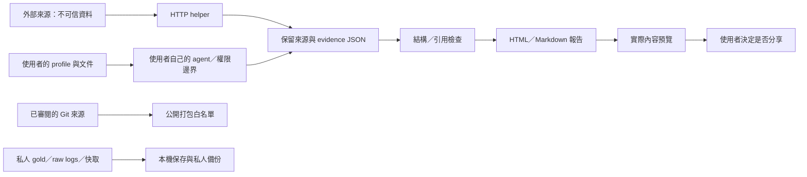

# Repository 與流程安全審查 — 2026-09-09

後續工作：[runner 統一執行指南](../runner-unification-2026-09-09/migration.md)、
[新版品質 A/B 協定](../runner-unification-2026-09-09/protocol.md)。本頁保留原安全審查的時間點與量測範圍。

這次從交付版本 `cb9ed3e` 開始，讀取 README、產品／pipeline 契約、Claude 留下的公開發布計畫與 vendor-neutral 專案記憶，並對工具、打包、viewer、模型 runner 和資料保存分工審查。找到可重現問題後直接修補，使用本機合成輸入、mock 與 dummy 子程序測試；沒有呼叫 Claude 或其他受測模型，也沒有發布、寄信或傳送私人資料。

**產品目的**是讓使用者用自己的 agent 與存取權限，審查倫敦房源的身份、成本、居住風險與證據缺口，產生可追溯的報告。它是協助選擇看房對象的本機工具，v1 不做託管服務、自動代寄信或代替使用者簽約付款。Claude 的私人專案記憶僅用於理解背景，沒有複製進 repo；過去設計草案和實測結果衝突時，以後來的實測與目前使用者指示為準。

## 1. 已修正的具體問題

嚴重程度按這個本機工具的實際前提判斷，沒有把「可構造漏洞」說成「已發生外洩」。同一使用者帳號下的惡意程式仍可改寫程式碼，這不是 Python helper 能隔離的威脅。

| ID | 問題與觸發條件 | 影響 | 修正與驗證入口 |
|---|---|---|---|
| S01 | 公開打包遞迴掃描工作目錄，會收進未追蹤 `.env`／私人 profile，也會讀取檔案 symlink 的外部目標 | 高：若發布該 zip，可能外洩本機資料 | `tools/build_dist.py` 改用 Git index 路徑清單、排除 runtime/credential 路徑、拒絕來源連結；`tests/test_packaging_security.py` |
| S02 | 私人 A/B tar 在一般 umask 下是 0644，且使用可預測暫存 README | 中：其他本機帳號可讀私人 gold；暫存檔碰撞 | 私人暫存／輸出 0600、新目錄 0700、README 在記憶體生成、atomic replace；拒絕非一般檔案與 symlink 目標 |
| S03 | crafted `PP1` seed 可透過換行、引號或註解提示注入新的 YAML 設定 | 中：匯入陌生種子可改變未列入分享清單的設定 | 支援值與巢狀型別檢查、YAML string escaping、註解單行化；`tests/test_seed.py` |
| S04 | curl 直接寫入 cache path；預先放置的 symlink 可導向其他可寫檔案；中斷可能留下不一致快取 | 中：本機檔案覆寫／錯誤證據重播 | owned cache、私有 staging、atomic replace、body/metadata hash；失敗下載保留原圖片；`tests/test_fetch_cache.py` |
| S05 | curl 接受非 HTTP 協定、隱含 curlrc 設定，POST 字串以 `@` 開頭可被當成檔案；URL／Authorization 出現在 argv | 中：呼叫輸入或本機設定可觸發額外讀檔，process list 可顯示憑證 | 明示 HTTP(S)、停用 curlrc、literal POST、私密 stdin config；含憑證請求拒絕 redirects；API 不落盤快取 |
| S06 | 舊 runner 把 `--allowedTools` 誤當可用工具白名單，worker 宣稱無工具卻未限制 built-ins／MCP | 高：模型處理不可信來源時具有超出實驗宣稱的能力 | 分開設定 `--tools` 與 permission rules，排除 inherited MCP/settings/hooks；no-tools helper 真正設空工具，worker 使用隔離 cwd；`tests/test_launch.py` 等 |
| S07 | 舊 timeout 只殺父程序；重試總量只回報最後一次；平行任務按等待時間計算 timeout | 高：背景工作繼續耗用資源、重複執行與低估成本 | owned process/session cleanup、實際開始時間 deadline、預設一次、保留每次 attempt，缺 telemetry 的合計為 unknown；離線子程序驗證 |
| S08 | Markdown report 欄位未全部 escape；惡意內容可在寬鬆 renderer 形成 HTML、遠端 image 或 active link；invalid viewer 輸入可能留下上一份可下載報告 | 中：開啟／分享後可能執行或載入非預期內容、拿錯報告 | 資料欄位 escape、viewer 先清除舊狀態；`tests/test_render_security.py` |
| S09 | copy-deck lock 可指定 `../`／外部路徑或冒充 writable surface | 中：使用被修改的 deck metadata 回寫可覆蓋其他檔案 | 路徑限制於 repo 與註冊 surfaces、拒絕 symlink、不可提升 read-only surface；`tests/test_copy_deck.py` |
| S10 | verifier 在空 source map 時讓虛構 source ID pass；profile validator 讓非數值預算／limit 通過 | 中：沒有依據的證據或失效硬限制被當成有效 | source resolution 不再依 map truthiness；numeric finite/non-bool 與 mapping shape 檢查；`tests/test_verify.py`、`tests/test_profile_check.py` |
| S11 | 分享頁保證「不含姓名、地址、金錢」，但 permitted free text 可保留這些內容；角色文件宣稱同一對話寫檔即可隔離記憶 | 中：使用者對隱私與證據隔離有錯誤期待 | CLI、viewer、sharing 文件區分結構欄位排除與自由文字；展示實際內容再分享；同 context 分階段僅是紀錄，不是隔離 |
| S12 | 法規摘要把一般 assured tenancy 規則套用到所有租約，並誤寫「首次付款後」的一個月上限 | 中：可能誤判宿舍／licence、付款時點與合約 | 先確認 agreement type/date/payment stage；同步 router、threshold、glossary、schema、onboarding 與計算步驟；來源見下一節 |

修補交叉審查還抓到三個初稿問題：發布 zip 的目標若是目錄，不能先刪舊 prompt pack；私人輸出不能先沿 symlink 建目錄再拒絕；FIFO 等非一般輸出必須拒絕。已補上事前檢查與回歸，避免安全修補本身破壞既有檔案。

## 2. 法規與產品契約修正

GOV.UK 對一般私人 assured tenancy 的預付租金規則分成簽約前、簽約後至起租前、起租後三個階段。通常的月租一個月上限是 pre-tenancy 規則；週租、舊約、特定住房與自願提前付款有不同處理。不能用一句「首次付款後最多一個月」涵蓋。[官方地方政府指引](https://www.gov.uk/government/publications/asking-for-rent-in-advance-guidance-for-local-authorities/asking-for-rent-in-advance-guidance-for-local-authorities)。

學生宿舍與符合 code 條件的私營 PBSA 通常使用 common law tenancy 或 licence；不應只因固定期或付款表不同就套用私人 assured tenancy 的結論。[GOV.UK 學生租約說明](https://www.gov.uk/private-renting/student-tenancies)。押金五／六週與留位費一週的分支另見[官方租金與押金說明](https://www.gov.uk/assured-periodic-tenancies-tenants/rent-in-advance-and-deposits)。本次是針對已發現範圍錯誤的核對，並非整套租賃法律內容的法律意見或逐條認證。

原 pipeline 文件同時寫著「實測不推薦」與「遇到 deep／shortlist 就啟動」，已改為保留歷史設計、預設仍單一 agent。README 的舊進度和設定建議也對齊後來實驗。更新 router 時，8,000 字元 prompt pack 一度因 greedy trimming 掉了必答表；baseline 單獨測試是通過的，這是本次新增文字造成的 regression。已縮短 router，並改成必要 asking rules 和 F1–F18 放不下就 build failure，不能無聲刪除。

## 3. 整條流程還有哪些邊界

- **模型環境**：限制 built-ins 不代表所有 host 都具備 filesystem containment。Codex read-only 仍能讀檔；既有 ablation transcript 零 tool events 是實際觀察，不是阻止讀取 gold 的安全證明。對抗性測試應用專用 OS account/container 與有限 mounts，不能靠 prompt 要求「只看這包」。
- **網路**：HTTP(S) 限制不是 public-host allow-list，未完整防 DNS rebinding／SSRF，亦無全域 response-size ceiling。這個 repo 是本機工具；直接包成公開 URL-fetch service 前仍須實作網路與容量隔離。帶 custom headers／憑證或 POST 的 redirect 會拒絕，需要使用最終 endpoint；本次未對所有外部資料源做 live smoke。
- **本機資料**：舊 cache 未自動改權限；source directory 仍可跟隨本機檔案 symlink。讓不可信的人控制來源資料夾，與只貼入文字是不同風險。原始 logs、私人 gold、CLI metadata 與備份都不是公開發布資產。
- **verifier**：recognized source 缺保留原文仍可 structural pass，會列 `quotes_unchecked`；`computed_by` 字串不是執行證明。來源 ID、exact quote、referent、數值與決策正確性是不同檢查。
- **品質**：這次修補沒有新的模型品質 A/B。新的 prompt／tool limits 可能影響效果與成本；不能引用舊研究分數宣稱修補後等效。先通過 offline regression，再另行預算／凍結／授權 live 對照。
- **發布**：tracked allow-list 不會辨識藏在正常檔名中的私密敘述。發布前仍需看 archive members 與內容；只發布指定 public artifacts，不能整個 `dist/` 上傳。copy deck 的 source hash 變舊時，先保留作者待回覆改字再重新 extract。

## 4. Secrets、保存與驗證

以不輸出憑證值的 pattern scan 檢查 baseline 489 份 tracked files，以及所有 reachable history 的 946 個 unique blobs（1,898 個 Git objects）。唯一命中是 `tests/test_streetview.py` 的明示 dummy。沒有找到真實 token／private key 的證據；這不涵蓋所有 ignored private files，也不保證自由文字沒有個資。[掃描範圍與結果](secret-scan.json)。

已逐檔驗證 **3,828 份歷史 raw artifacts** 與舊備份 inventory 的 SHA-256 相符；frozen commits 保留。這次修改是新版本，不覆寫舊實驗。[完整性檢查](preservation.json)。原始七場 Claude 確認仍暫停。完整離線測試 **1,698 項通過**（36.844 秒），公開 ZIP 77 個 members、checksums 驗證通過；prompt pack **7,916 字元**且保留全部 18 題。詳細 log、hash preservation、commit 和本機備份位置見 [最終驗證](validation.json)，另有 [runner 專項審查](runner-review.md)。不以測試數量代表沒有漏洞；本次是有界的 source review 與 offline regression，沒有做外部滲透測試。

使用／發布邊界的短版放在 repo 根目錄 [SECURITY.md](../../SECURITY.md)。
